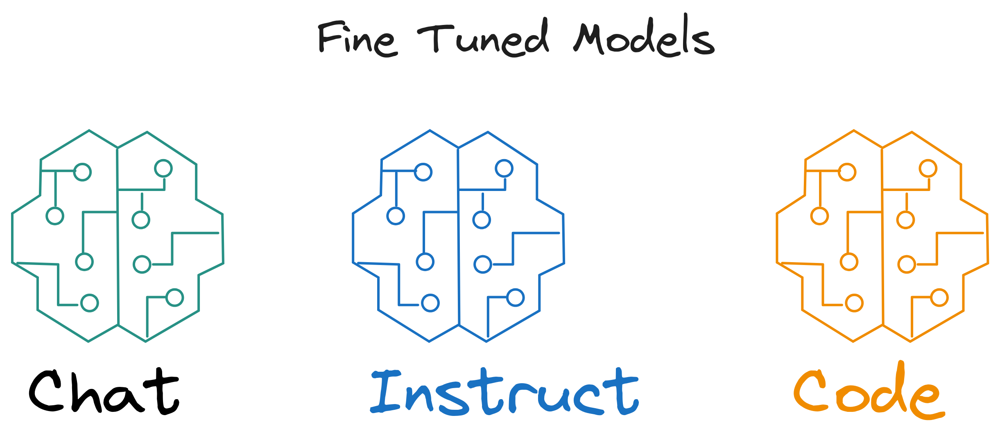
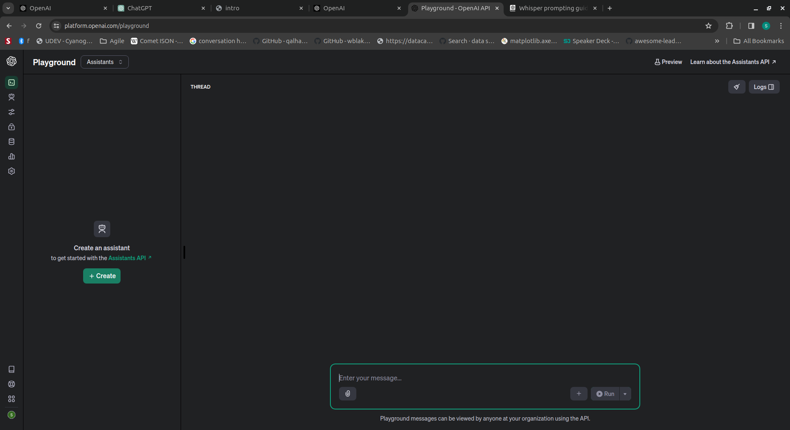
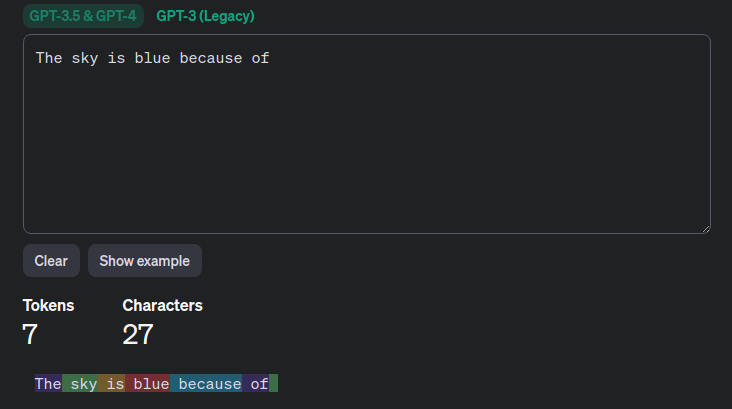
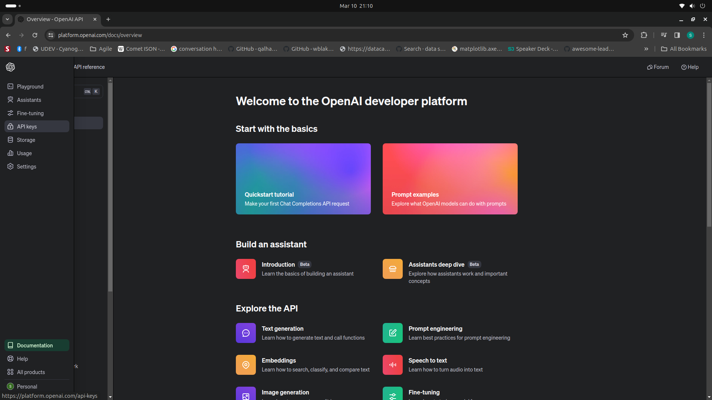
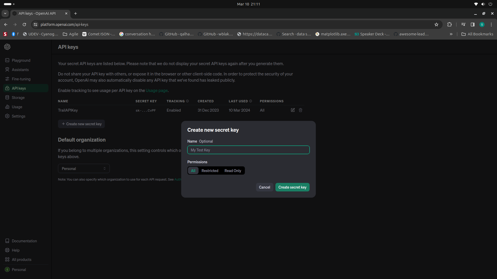

---

### Welcome to Generative AI

:::{}
Generative AI
: Known as **Gen**erative **A**rtificial **I**ntelligence, is a branch of AI that focuses on creating new content, like text, images, music, and even code.
:::

:::{}
- **Core functionality:** Generates novel content in various formats (text, images, audio, code) based on learned patterns.
- **Underlying technology:** Employs machine learning models, often **Large Language Models (LLMs)** trained on vast amounts of data.
- **Training process:** Typically involves supervised learning, where the model is exposed to paired examples of input data and desired output, enabling it to learn the mapping between them.
- **Applications:** Diverse applications across various domains, including creative content generation, product design, drug discovery, and data augmentation.
:::

---

### GenAI Modeling Types

:::: {.columns}

::: {.column width="50%"}


:::

::: {.column width="50%"}
- **Variational Autoencoders (VAEs):** Encode data into a latent space and then decode it to generate new samples that maintain the original data's statistical properties.

---

- **Generative Adversarial Networks (GANs):** 
    - a generator that creates new data and 
    - a discriminator that tries to distinguish real data from generated data. 
:::

::::

---

### What is LLM?

The fundamental part of Generative AI.

- ***Large:***
  - large refers to the massive amount of training data. 
  - size can range from hundreds of gigabytes to terabytes.
  - Model weights size also too high
  - Infrastructure for Training too. 

- ***Language:***
  - model's ability to understand and process human language. 
  - aspects like grammar, syntax, semantics, and pragmatics. 
  -  adept at recognizing patterns and relationships within language.

- ***Model:*** 
  - kind of neural network architecture called a transformer. 
  - learns from the vast amount of data to identify patterns and relationships within language.

---
 

### LLM Common Tasks

{fig-align="center"}

---

### Fine Tuned Models

{fig-align="center"}

--- 

### Commercial LLMs & Providers - OpenAI 


| MODEL | 	DESCRIPTION |
| ---|--|
| GPT-4 and GPT-4 Turbo	| A set of models that improve on GPT-3.5 and can understand as well as generate natural language or code |
| GPT-3.5 Turbo |	A set of models that improve on GPT-3.5 and can understand as well as generate natural language or code |
|DALL·E	| A model that can generate and edit images given a natural language prompt |
|TTS |	A set of models that can convert text into natural sounding spoken audio |
|Whisper |	A model that can convert audio into text |
|Embeddings |	A set of models that can convert text into a numerical form |
|Moderation	| A fine-tuned model that can detect whether text may be sensitive or unsafe |
: {tbl-colwidths="[25,75]"}

---

### Commercial LLMs & Providers - Google

| MODEL | 	DESCRIPTION |
| ---|--|
| Gemini 1.0 Pro | Designed to handle natural language tasks, multiturn text and code chat, and code generation.|
| Gemini 1.0 Pro Vision |Multimodal model that supports adding image and video in text or chat prompts for a text or code response. |
| Gemini 1.0 Ultra| Google's most capable multimodal model, optimized for complex tasks including instruction, code, and reasoning, with support for multiple languages. |
| Gemini 1.0 Ultra Vision | Google's most capable multimodal vision model, optimized to support text, images, videos, and multi-turn chat. |
| Gemini 1.5 Pro | Google's mid-size multimodal model, optimized for scaling across a wide-range of tasks. Gemini 1.5 Pro supports long-context understanding with up to 1 million tokens. |
: {tbl-colwidths="[25,75]"}

---

### Commercial LLMs & Providers  - Anthropic

| MODEL | 	DESCRIPTION |
| ---|--|
| Claude 3 Opus | Most powerful model for highly complex tasks, Top-level performance, intelligence, fluency, and understanding	 |
| Claude 3 Sonnet |	Ideal balance of intelligence and speed for enterprise workloads. Maximum utility at a lower price, dependable, balanced for scaled deployments	|
| Claude 3 Haiku | Fastest and most compact model for near-instant responsiveness. Quick and accurate targeted performance|
| Claude 2.1 |	Updated version of Claude 2 with improved accuracy, Legacy model - performs less well than Claude 3 models. |
| Claude 2 |Predecessor to Claude 3, offering strong all-round performance. Legacy model - performs less well than Claude 3 models. |
| Claude Instant 1.2 | Our cheapest small and fast model, a predecessor of Claude Haiku.Legacy model - performs less well than Claude 3 models. |
: {tbl-colwidths="[25,75]"}

---

### Open Source LLMs & Providers - Meta

| MODEL | 	DESCRIPTION |
| ---|--|
| Llama 2 | The Llama 2 model family, offered as both base foundation models and fine-tuned “chat” models, serves as the successor to the original LLaMa 1 models.|
| Code Llama | Code Llama is state-of-the-art LLM on code tasks, and has the potential to make workflows faster and more efficient. |
| Llama Guard | a LLM-based input-output safeguard model geared towards Human-AI conversation use cases.|
: {tbl-colwidths="[25,75]"}

---

### LLMs List

[LLM Explorer](https://llm.extractum.io/)

[LLM Leaderboard](https://www.vellum.ai/llm-leaderboard)

---

### OpenAI Playground



---

### Tokens

:::: {.columns}

::: {.column width="50%"}
Token
:  the basic units of data that Large Language Models (LLMs) process.
: - both input and output data 
: - Tokenization vary depending on model tokenizer
: - Every model has limit on max tokens
: - LLM Providers charge per token and varies by model

:::

::: {.column width="50%"}


[OpenAI Tokenizer](https://platform.openai.com/tokenizer)
https://platform.openai.com/tokenizer
:::

::::

---

### Prompt

:::: {.columns}

::: {.column width="50%"}
Prompt
:   a piece of input text provided to the model to initiate or guide its generation of output.
: - are foundational to interacting with LLMs
- it can contain instructs, context and examples
- Prompting is an engineering discipline 
  - as it involves systematic, skillful manipulation of input text to guide LLM to produce desired outputs

:::

::: {.column width="50%"}

{fig-align="center" }

:::

::::

---

### Why Prompting is Engineering?

- *Strategic Crafting:* Crafting effective prompts requires understanding how different inputs influence the model's outputs, requires strategic approach to elicit desired responses.

- *Optimization for Specific Tasks:* Prompts must often be optimized for specific tasks or outcomes, such as generating code, writing in a particular style, or providing precise answers to questions.

- *Iterative Testing and Refinement:* Finding the most effective prompt often involves iterative testing and refinement.

- *Adaptation to Model Variations:* Different LLMs or even different versions of the same model may respond differently to the same prompt, requiring adjustments and customizations.

- *Balancing Brevity and Specificity:* Effective prompts balance being concise enough for practical use while providing sufficient specificity to guide the model's output accurately.
- *Leveraging Known Patterns:* Experienced prompt engineers leverage known patterns and tricks that have been found to improve model responses, such as using certain phrasings or including specific instructions within the prompt.
- *Understanding of Model Capabilities and Limitations:* Prompt engineers need a deep understanding of what the model can and cannot do, which guides how they frame prompts to avoid common pitfalls or misunderstandings.


---

### Environment Setup

#### Software

* VSCode
* Python 3.1x

Create Virtual Environment

```{.sh }
python -m venv genaivenv

#Linux output:

  genaivenv/
  ├── bin
  ├── include
  ├── lib
  ├── lib64 -> lib
  └── pyvenv.cfg
```

Activate Virtual Environment
```{.sh }
#windows 
genaivenv\Scripts\activate.bat

#Linux
source genaivenv/bin/activate
```

---

### Create & export OpenAI API Key

::: {layout-ncol=2}






```{.sh}

#Export OpenAI Key in command prompt

export OPENAI_API_KEY=
```
:::

---

### Hello World! with OpenAI REST API


```{.sh code-line-numbers="|5|9"}
curl https://api.openai.com/v1/chat/completions \
  -H "Content-Type: application/json" \
  -H "Authorization: Bearer $OPENAI_API_KEY" \
  -d '{
    "model": "gpt-3.5-turbo",
    "messages": [
      {
        "role": "user",
        "content": "What is the capital city of India?"
      }
    ]
  }'

#output
{
  "id": "chatcmpl-91FTnKGsJXddI5OyaiqXBOfPNq4l7",
  "object": "chat.completion",
  "created": 1710084859,
  "model": "gpt-3.5-turbo-0125",
  "choices": [
    {
      "index": 0,
      "message": {
        "role": "assistant",
        "content": "The capital city of India is New Delhi."
      },
      "logprobs": null,
      "finish_reason": "stop"
    }
  ],
  "usage": {
    "prompt_tokens": 15,
    "completion_tokens": 9,
    "total_tokens": 24
  },
  "system_fingerprint": "fp_4f0b692a78"
}

```
---

### Using Python SDK

Install OpenAI Python SDK

```{.sh}

# Activate your Virtual Environment before install

pip install openai

```

---

### Text & Code Generation

```{.python}
from openai import OpenAI


client = OpenAI()

# Non-streaming:
print("----- standard request -----")
completion = client.chat.completions.create(
    model="gpt-3.5-turbo",
    messages=[
        {
            "role": "user",
            "content": "How to greet a person in Sanskrit",
        },
    ],
)
print(completion.choices[0].message.content)

# Streaming:
print("----- streaming request -----")
stream = client.chat.completions.create(
    model="gpt-3.5-turbo",
    messages=[
        {
            "role": "user",
            "content": "How do I generate n prime numbers using Python?",
        },
    ],
    stream=True,
)
for chunk in stream:
    if not chunk.choices:
        continue

    print(chunk.choices[0].delta.content, end="")
print()

```

---

### OpenAI Speech Model 

```{.sh}
curl https://api.openai.com/v1/audio/speech \
  -H "Authorization: Bearer $OPENAI_API_KEY" \
  -H "Content-Type: application/json" \
  -d '{
    "model": "tts-1",
    "input": "Welcome to Generative AI world! ",
    "voice": "alloy"
  }' \
  --output speech.mp3
```

Python Code

```{.python}
from pathlib import Path
import openai

speech_file_path = Path(__file__).parent / "speech.mp3"
with openai.audio.speech.with_streaming_response.create(
        model="tts-1",
        voice="alloy",
        input="Welcome to Generative AI World!, Seshagiri",
   ) as response:
        response.stream_to_file(speech_file_path)

```
--- 

### OpenAI Image Model

```{.sh}
curl https://api.openai.com/v1/images/generations \
  -H "Content-Type: application/json" \
  -H "Authorization: Bearer $OPENAI_API_KEY" \
  -d '{
    "model": "dall-e-2",
    "prompt": "A beautiful sunset at seashore with sun is clearly visible along with sea waves",
    "n": 1,
    "size": "1024x1024"
  }'
```

Python Code

```{.python}
from openai import OpenAI

openai = OpenAI()

prompt = "An early morning long drive in Ferrari car with clear visibility of Ferrari logo and sun"
model = "dall-e-2"

# Generate an image based on the prompt
response = openai.images.generate(prompt=prompt, model=model)

# Prints response containing a URL link to image
print(response)

```