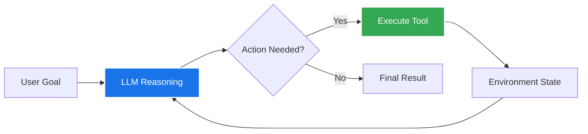
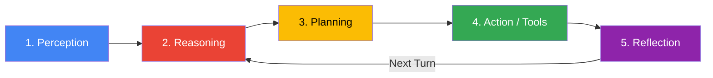
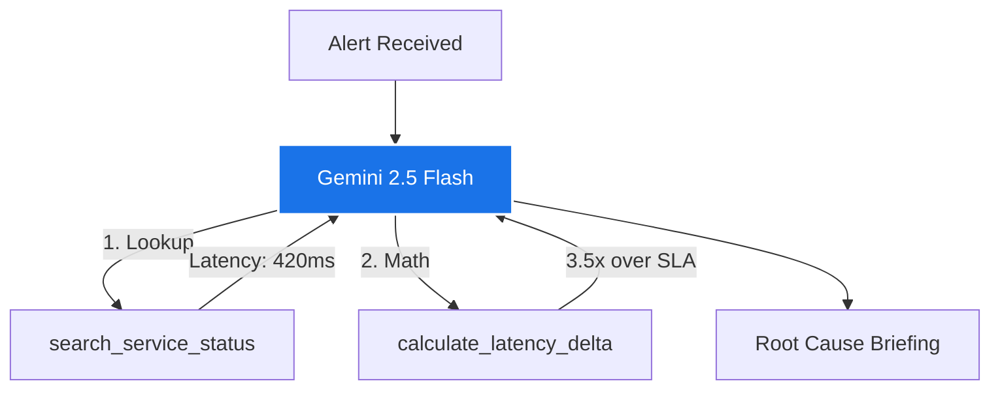

# Session 1: What is Agentic AI? {#session-1}

---

### Beyond Prompt-and-Response

::: columns
::: {.column width="50%"}
#### Traditional LLM Programming
- **Model:** Prompt in $\rightarrow$ Text out.
- **State:** Stateless, single-turn completion.
- **Capabilities:** Limited to static pre-trained weights.
- **Failures:** Hallucinates on live data, cannot take real actions in the world.
:::

::: {.column width="50%"}
#### Agentic AI Paradigm
- **Model:** Goal in $\rightarrow$ Multi-step execution.
- **State:** Stateful loop with memory.
- **Capabilities:** Queries APIs, databases & tools.
- **Self-Repair:** Observes tool output, diagnoses errors, and adapts plan autonomously.
:::
:::



---

### Generative AI vs. Agentic AI

> As defined by **Google Cloud**, Agentic AI represents the evolution from content generation to autonomous execution.

::: columns
::: {.column width="50%"}
#### Generative AI
- **Primary Focus:** Content creation (text, images, synthetic data, code).
- **Core Engine:** The LLM is the direct output generator.
- **Interaction:** Synchronous input/output; single-shot or basic chat.
- **Metaphor:** The *artist* or *writer* drafting content.
:::

::: {.column width="50%"}
#### Agentic AI
- **Primary Focus:** Goal achievement and business workflow execution.
- **Core Engine:** The LLM acts as the **cognitive brain** orchestrating tools.
- **Interaction:** Autonomous, iterative, multi-turn execution.
- **Metaphor:** The *engineer* or *coordinator* managing a project.
:::
:::

---

### Bots vs. Assistants vs. Agents

| Characteristic | Bots | AI Assistants | AI Agents |
| :--- | :--- | :--- | :--- |
| **Primary Purpose** | Automate simple tasks / scripts | Assist users with workflows | **Autonomously achieve goals** |
| **Control Logic** | Rigid pre-defined rules | Model suggests; **human decides** | **Independent decision & action** |
| **Interaction** | Reactive to specific triggers | Reactive to user prompts | **Proactive & goal-oriented** |
| **Adaptability** | None (fails on edge cases) | Relies on user guidance | **Iterative self-refining loop** |
| **Environment** | Isolated | Application-specific | **Connected via external tools** |

: {tbl-colwidths="[20,25,25,30]"}

---

### The 5-Stage Cognitive Loop



::: columns
::: {.column width="50%"}
- **1. Perception:** Ingests prompt, conversation history, and live tool responses.
- **2. Reasoning:** Analyzes context with Gemini to infer state and next step.
- **3. Planning:** Decomposes objective into ordered sub-goals and tool calls.
:::

::: {.column width="50%"}
- **4. Action:** Emits structured function calls to query databases or APIs.
- **5. Reflection:** Evaluates tool results, detects failures, and refines strategy.
:::
:::

---

### Agent Taxonomy: Interaction & Topology

::: columns
::: {.column width="50%"}
#### By Interaction Mode
- **Interactive Partners (Surface Agents):**
  - Synchronous, user-facing assistants.
  - User-prompt triggered; provides immediate answers and recommendations.
- **Autonomous Background Agents:**
  - Asynchronous, event-driven processes.
  - Listens to queues, alerts, or schedules (e.g., automated CI/CD triage).
:::

::: {.column width="50%"}
#### By System Topology
- **Single-Agent System:**
  - One model managing one set of tools.
  - Ideal for well-scoped, deterministic domains.
- **Multi-Agent System:**
  - Specialized agents collaborating or debating.
  - Distributes cognitive load across personas and distinct foundation models.
:::
:::

---

### When to Use Agents (and When NOT To)

::: columns
::: {.column width="50%"}
::: {.callout-tip}
### High-Value Agent Use Cases
- **Dynamic Exploration:** Investigating incident logs or debugging code.
- **Variable Tool Paths:** The exact sequence of tools cannot be hardcoded in advance.
- **Self-Healing Workflows:** Tasks where tool errors provide corrective signal.
- **Multi-Source Synthesis:** Aggregating data across CRM, APIs, and databases.
:::
:::

::: {.column width="50%"}
::: {.callout-caution}
### When to Avoid Agents
- **Deterministic Workflows:** When a simple Python script or DAG always works.
- **Strict Latency Limits:** Sub-500ms requirements (agent turns take seconds).
- **High-Stakes Blind Writes:** Financial transfers or production drops without human gates.
- **Cost-Sensitive High Volume:** High-QPS simple queries where an LLM is overkill.
:::
:::
:::

---

### Lab 1 Scenario: Cloud Diagnostic Agent

::: columns
::: {.column width="55%"}
#### The Engineering Challenge
Build an autonomous diagnostic agent using **Gemini 2.5 Flash** that:
1. Receives an alert: *"Why is checkout failing?"*
2. Dispatches `search_service_status` to inspect `auth-service` and `checkout-api`.
3. Calls `calculate_latency_delta` to compare current p99 vs SLA threshold.
4. Synthesizes findings into a root-cause incident briefing.
:::

::: {.column width="45%"}

:::
:::

---

### Lab 1: Tool Definitions

```python
"""Lab 1 - Tool definitions for Gemini Agent Loop."""

# In-memory service registry simulating a live infrastructure DB
SERVICE_CATALOG = {
    "auth-service": {"status": "HEALTHY", "p99_ms": 45, "sla_ms": 50},
    "checkout-api": {"status": "DEGRADED", "p99_ms": 420, "sla_ms": 120},
    "payment-gateway": {"status": "HEALTHY", "p99_ms": 85, "sla_ms": 100},
}

def search_service_status(service_name: str) -> str:
    """Search internal registry for service status, p99 latency, and SLA."""
    key = service_name.lower().strip()
    if key in SERVICE_CATALOG:
        info = SERVICE_CATALOG[key]
        return f"{key}: status={info['status']}, p99={info['p99_ms']}ms, SLA={info['sla_ms']}ms"
    return f"Service '{service_name}' not found in registry."

def calculate_latency_delta(current_ms: float, sla_ms: float) -> str:
    """Calculate the ratio and difference between current latency and SLA."""
    if sla_ms <= 0:
        return "Invalid SLA value."
    ratio = current_ms / sla_ms
    diff = current_ms - sla_ms
    return f"Delta: +{diff:.1f}ms ({ratio:.2f}x of allowed SLA threshold)"
```

---

### Lab 1: Autonomous ReAct Loop

```python
"""Lab 1 - Autonomous Gemini 2.5 Flash execution loop."""
from google import genai
from google.genai import types

client = genai.Client()
tools = [search_service_status, calculate_latency_delta]

def run_diagnostic_agent(query: str):
    chat = client.chats.create(
        model="gemini-2.5-flash",
        config=types.GenerateContentConfig(
            tools=tools,
            temperature=0.0,
            system_instruction="You are an autonomous SRE diagnostic agent. Use tools to verify infrastructure metrics."
        )
    )
    response = chat.send_message(query)
    
    # Model autonomously calls tools until it returns a final answer
    while response.function_calls:
        for call in response.function_calls:
            print(f"🔧 [Tool Call] {call.name}({call.args})")
        # Gemini chat handles execution & tool response injection automatically
        response = chat.send_message(types.Part.from_function_response(...))
        
    print(f"✅ [Final Diagnosis]:\n{response.text}")
```

---

### Lab 1: Execution Trace in Action

```text
[User Prompt]: "Check checkout-api health and verify if it violates our SLA threshold."

[Turn 1 - Reasoning]: Need to check the current metrics for checkout-api.
🔧 [Tool Call]: search_service_status(service_name="checkout-api")
📥 [Observation]: checkout-api: status=DEGRADED, p99=420ms, SLA=120ms

[Turn 2 - Reasoning]: Latency is 420ms with a 120ms SLA. Calculate the exact delta.
🔧 [Tool Call]: calculate_latency_delta(current_ms=420.0, sla_ms=120.0)
📥 [Observation]: Delta: +300.0ms (3.50x of allowed SLA threshold)

[Turn 3 - Reasoning]: Have both status and quantitative metrics. Formulating final briefing.

✅ [Final Diagnosis]:
checkout-api is currently DEGRADED with a p99 latency of 420ms. This exceeds the 
120ms SLA threshold by +300.0ms (operating at 3.50x the allowed limit). Immediate 
investigation of downstream dependencies is recommended.
```

---

### Session 1 Review & Self-Check

::: columns
::: {.column width="50%"}
#### What We Covered
- **Prompt vs. Agent:** Transitioned from text generation to goal-directed loops.
- **Google Cloud Taxonomy:** Differentiated bots, assistants, and autonomous agents.
- **The 5-Stage Cycle:** Perception, Reasoning, Planning, Action, and Reflection.
- **ReAct in Practice:** Implemented an autonomous tool-calling loop in Gemini 2.5 Flash.
:::

::: {.column width="50%"}
::: {.callout-note}
### Self-Check Questions
1. *What is the critical behavioral difference between an AI Assistant and an AI Agent?*
2. *Why do tool execution errors serve as valuable feedback in an agent loop?*
3. *Name two scenarios where writing standard Python is preferable to building an agent.*
:::
:::
:::
