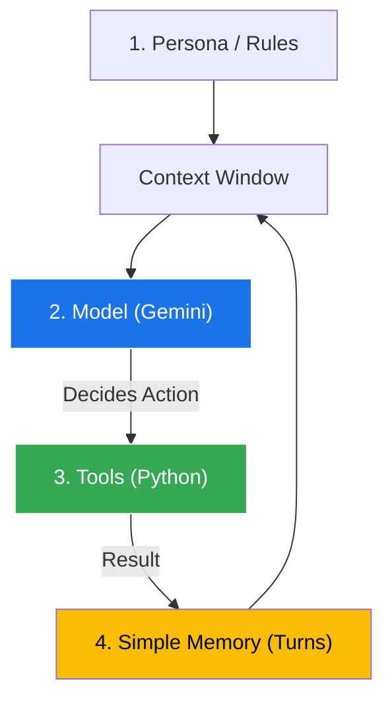
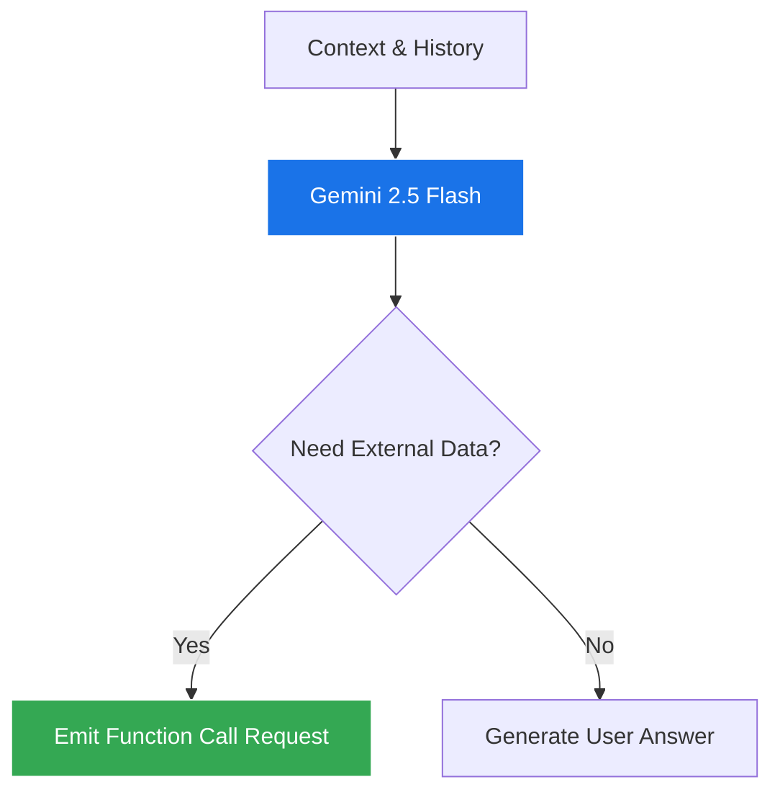
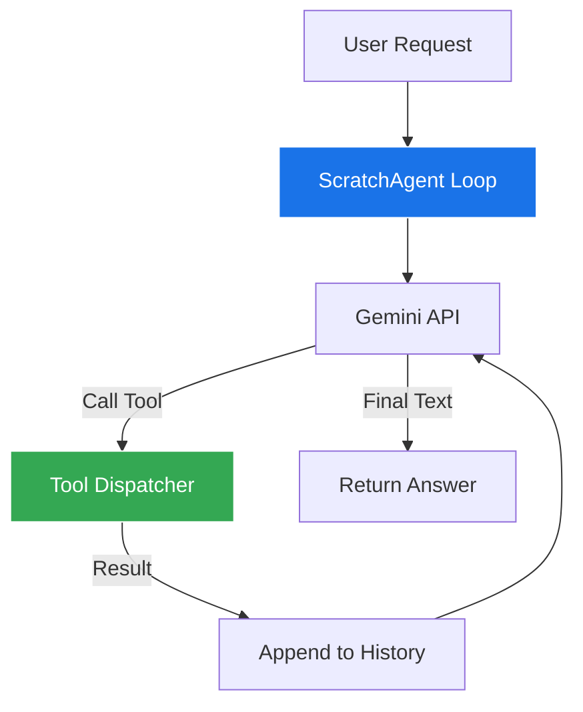

# Session 2: Anatomy of an Agent {#session-2}

---

### Deconstructing the Black Box

::: columns
::: {.column width="55%"}
#### Agents Are Not Magic
An AI agent is a software program built from **four standard software components** wrapped around a foundation model:

1. **Persona & Instructions:** The agent's role, rules, and boundaries.
2. **Foundation Model:** The reasoning engine (Gemini 2.5 Flash).
3. **Tools:** Regular Python functions the model can call.
4. **Memory:** An ordered list of turns preserving conversation state.
:::

::: {.column width="45%"}

:::
:::

---

### Pillar 1: Persona & System Instructions

::: columns
::: {.column width="50%"}
#### Setting the Ground Rules
The system instruction defines **who the agent is** and **how it behaves**:

- **Role:** *"You are an SRE incident response assistant."*
- **Constraints:** *"Never execute destructive commands without approval."*
- **Format:** *"Always respond in concise markdown bullet points."*
- **Grounding:** *"If data is unavailable in tools, state that you do not know."*
:::

::: {.column width="50%"}
::: {.callout-note}
### Why System Instructions Matter
Without clear constraints, LLMs default to generic conversational tone. 

Strict instructions keep the agent focused on task execution and prevent hallucinating fake tool capabilities.
:::
:::
:::

---

### Pillar 2: The Foundation Model as the Brain

::: columns
::: {.column width="50%"}
#### The Reasoning Engine
The model is **not** the entire agent—it is the decision-making engine:

- Ingests the current context (system instructions + memory).
- Determines if the user's goal can be answered immediately or requires external data.
- Outputs either **plain text** or a **structured tool call request**.
:::

::: {.column width="50%"}

:::
:::

---

### Pillar 3: Tools Are Just Python Functions

::: columns
::: {.column width="55%"}
#### How the Model "Sees" Tools
A tool is simply a normal Python function with two critical elements:
1. **Type Annotations:** Tells the model what data type each argument expects (`str`, `int`, `float`).
2. **Clear Docstrings:** Explains **what** the tool does and **when** the model should pick it.

> The LLM never sees your Python code—it only reads the auto-generated **JSON Schema**!
:::

::: {.column width="45%"}
```python
def query_ticket_status(
    ticket_id: str
) -> str:
    """Retrieve the status and assignee 
    for an internal IT support ticket."""
    # Model reads this docstring 
    # to decide when to call it!
    return f"Ticket {ticket_id}: Closed"
```
:::
:::

---

### Pillar 4: Simple Working Memory

::: columns
::: {.column width="50%"}
#### How an Agent "Remembers"
By default, LLM APIs are completely **stateless**. 

To maintain context across multiple tool calls and user turns:
- We maintain a simple list of messages (`list[dict]`).
- Each turn appends:
  - User request
  - Model's tool call request
  - Tool execution result
  - Model's final response
:::

::: {.column width="50%"}
```python
# The simplest memory: an append-only list
history = [
  {"role": "user", "parts": "Check db-1 status"},
  {"role": "model", "parts": "call: get_status('db-1')"},
  {"role": "tool", "parts": "status: UP, cpu: 82%"},
  {"role": "model", "parts": "db-1 is UP but under high CPU."}
]
```
:::
:::

---

### Context Window: The Whiteboard Mental Model

::: columns
::: {.column width="55%"}
#### The Working Whiteboard
Think of the context window as a **conference room whiteboard**:

- Everything the model needs to make a decision must fit on the board.
- The system instructions stay written at the top.
- Every question, tool call, and tool output takes up whiteboard space.
- If the whiteboard gets cluttered with irrelevant logs, the model loses focus.
:::

::: {.column width="45%"}
::: {.callout-tip}
### Golden Rule for Beginners
**Keep tool outputs concise.** 

Return only the fields the agent actually needs to decide the next step, not raw 5,000-line JSON dumps!
:::
:::
:::

---

### Lab 2 Scenario: Scratch Agent Runtime

::: columns
::: {.column width="55%"}
#### Lab Objective
Build an agent from scratch in **pure Python** (no agent frameworks) with:
1. A clear system persona: `SupportAgent`.
2. Two typed tools: `lookup_user` and `reset_password`.
3. An internal message history list for memory.
4. An autonomous while loop handling tool dispatch.
:::

::: {.column width="45%"}

:::
:::

---

### Lab 2: Tool Registry & Definitions

```python
"""Lab 2 - Step 1: Tool definitions with typed contracts."""

# Mock database simulating user identity service
USER_DB = {
    "alice@corp.com": {"name": "Alice", "role": "Engineer", "active": True},
    "bob@corp.com": {"name": "Bob", "role": "Contractor", "active": False},
}

def lookup_user(email: str) -> str:
    """Lookup employee details, active status, and role by corporate email."""
    user = USER_DB.get(email.lower().strip())
    if not user:
        return f"Error: No employee found with email '{email}'."
    return f"User: {user['name']}, Role: {user['role']}, Active: {user['active']}"

def reset_password(email: str) -> str:
    """Trigger a secure password reset link sent to an active employee."""
    user = USER_DB.get(email.lower().strip())
    if not user:
        return f"Cannot reset password: user '{email}' does not exist."
    if not user["active"]:
        return f"Action rejected: user '{email}' is marked INACTIVE. Contact HR."
    return f"Success: Temporary reset token issued to {email}."

# Registry mapping tool names to callable Python functions
TOOLS = {
    "lookup_user": lookup_user,
    "reset_password": reset_password,
}
```

---

### Lab 2: The `ScratchAgent` Class

```python
"""Lab 2 - Step 2: Pure Python Agent Class with Memory."""
from google import genai
from google.genai import types

class ScratchAgent:
    def __init__(self, system_prompt: str, tools: list):
        self.client = genai.Client()
        self.system_prompt = system_prompt
        self.tool_map = {f.__name__: f for f in tools}
        # In-memory turn buffer
        self.chat = self.client.chats.create(
            model="gemini-2.5-flash",
            config=types.GenerateContentConfig(
                tools=tools,
                temperature=0.0,
                system_instruction=system_prompt,
            )
        )

    def run(self, user_message: str) -> str:
        """Execute autonomous tool loop until plain text answer is produced."""
        response = self.chat.send_message(user_message)
        
        while response.function_calls:
            for call in response.function_calls:
                func = self.tool_map.get(call.name)
                tool_result = func(**call.args) if func else f"Tool {call.name} not found."
                # Feed tool result back into the chat session
                response = self.chat.send_message(
                    types.Part.from_function_response(name=call.name, response={"result": tool_result})
                )
        return response.text
```

---

### Lab 2: Testing Memory & Tool Safety

```python
"""Lab 2 - Step 3: Running the Scratch Agent across multiple turns."""

agent = ScratchAgent(
    system_prompt="You are an IT helpdesk bot. Verify user active status before resetting passwords.",
    tools=[lookup_user, reset_password],
)

# Turn 1: Lookup Bob and attempt reset
print(agent.run("Can you reset the password for bob@corp.com?"))

# Turn 2: Follow-up relying on conversation memory
print(agent.run("Why was Bob's password reset rejected? Remind me what his status was."))
```

::: {.callout-note}
### Key Observation
In Turn 2, the agent **does not call the tool again**! It reads Bob's status directly from its conversation memory buffer.
:::

---

### Session 2 Review & Self-Check

::: columns
::: {.column width="50%"}
#### What We Mastered
- **The 4 Pillars:** Persona, Foundation Model, Tools, and Memory.
- **The Whiteboard Model:** Managing context as a finite working space.
- **Tools as Contracts:** How docstrings and types guide the LLM.
- **Scratch Runtime:** Built an agent without any external frameworks.
:::

::: {.column width="50%"}
::: {.callout-tip}
### Self-Check Questions
1. *Where does an agent store its memory during a multi-turn session?*
2. *Why does omitting docstrings from tool functions cause models to fail?*
3. *What happens if tool outputs are thousands of lines of unneeded data?*
:::
:::
:::
