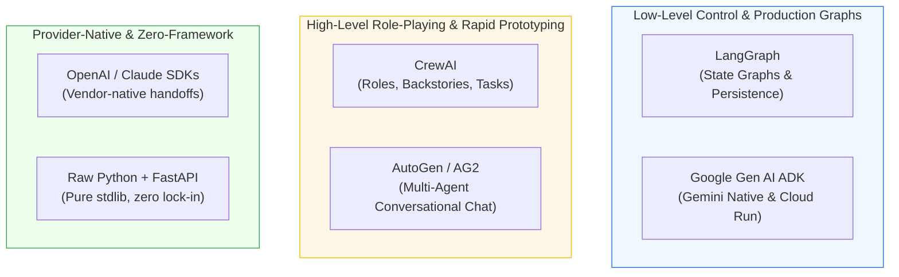
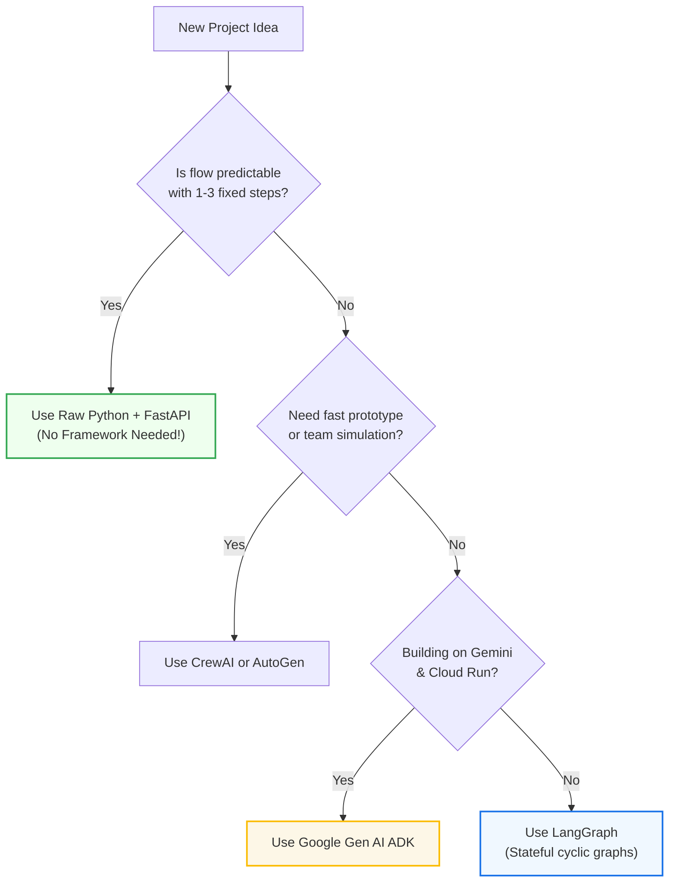
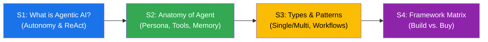

# Session 4: Framework Landscape & Decision Matrix {#session-4}

---

### The Framework Dilemma

::: columns
::: {.column width="50%"}
#### Framework Fatigue
The open-source AI ecosystem moves fast:
- Every week brings a "revolutionary" new agent library.
- Beginners often think: *"I must use a heavy framework to build a real agent."*
- **The Reality:** Heavy frameworks often add bloated abstractions, opaque prompt wrappers, and debugging nightmares.
:::

::: {.column width="50%"}
::: {.callout-important}
### The Golden Engineering Rule
**Never adopt a framework for what standard Python can do in 20 lines.**

Adopt a framework only when it solves hard production problems: **state persistence**, **complex cyclic graphs**, or **human interrupt resumption**.
:::
:::
:::

---

### The Major Contenders in 2026

---

### 1. LangGraph & Google Gen AI ADK

::: columns
::: {.column width="50%"}
#### LangGraph (Production Anchor)
- **Mental Model:** Directed Cyclic Graphs (State, Nodes, Edges).
- **Key Superpower:** Checkpointing & state resumption (`SqliteSaver`).
- **Best for:** Complex enterprise workflows, loops, and human-in-the-loop gates.
- **Trade-off:** Steeper learning curve; explicit schema wiring.
:::

::: {.column width="50%"}
#### Google Gen AI ADK (Agent Development Kit)
- **Mental Model:** Declarative agent definitions for Gemini.
- **Key Superpower:** Seamless Gemini multimodal grounding & Cloud Run scaling.
- **Best for:** Cloud-native agents and sub-agent delegation.
- **Trade-off:** Optimized primarily for the Google ecosystem.
:::
:::

---

### 2. CrewAI & AutoGen (AG2)

::: columns
::: {.column width="50%"}
#### CrewAI
- **Mental Model:** Role-playing team (Senior Researcher, Writer).
- **Key Superpower:** Extremely fast to prototype (working demo in 15 mins).
- **Best for:** Brainstorming, hackathons, content generation.
- **Trade-off:** Opaque prompt injection; hard to force strict determinism.
:::

::: {.column width="50%"}
#### AutoGen / AG2 (Microsoft)
- **Mental Model:** Conversational group chat between agents.
- **Key Superpower:** Dynamic back-and-forth debate and code execution.
- **Best for:** Simulation, automated bug hunting, research experiments.
- **Trade-off:** High token consumption; risk of endless conversational loops.
:::
:::

---

### The 5 Decision Criteria

::: columns
::: {.column width="50%"}
1. **Control & Determinism:**
   - Can you guarantee the exact sequence of critical steps?
2. **Speed to Prototype:**
   - How many lines of code to build a working prototype?
3. **Debugging & Observability:**
   - Can you trace errors back to standard Python stack traces?
:::

::: {.column width="50%"}
4. **State Persistence:**
   - If the server restarts mid-run, can the agent resume where it left off?
5. **Ecosystem & Vendor Lock-In:**
   - Does the framework bind you to a single model provider or cloud?
:::
:::

---

### Framework Evaluation Scorecard

| Dimension | Raw Python | LangGraph | Google ADK | CrewAI | AutoGen |
| :--- | :---: | :---: | :---: | :---: | :---: |
| **Control & Predictability** | ⭐⭐⭐⭐⭐ | ⭐⭐⭐⭐⭐ | ⭐⭐⭐⭐ | ⭐⭐ | ⭐⭐ |
| **Speed to Prototype** | ⭐⭐⭐ | ⭐⭐⭐ | ⭐⭐⭐⭐ | ⭐⭐⭐⭐⭐ | ⭐⭐⭐⭐ |
| **Debugging Simplicity** | ⭐⭐⭐⭐⭐ | ⭐⭐⭐⭐ | ⭐⭐⭐⭐ | ⭐⭐ | ⭐⭐ |
| **Stateful Persistence** | DIY | Built-in | Cloud-native | Limited | Limited |
| **Production Fit** | High | **Very High** | **Very High** | Moderate | Moderate |

: {tbl-colwidths="[26,14,15,15,15,15]"}

---

### Framework Selection Decision Flowchart

---

### Group Activity: Framework Defense

::: columns
::: {.column width="55%"}
#### Real-World Case Studies
Pick the best architectural approach for each scenario and defend your choice:

1. **Case A: Automated PR CI/CD Fixer**
   - Must run linters, fix unit tests, and pause for tech lead approval before committing.
2. **Case B: Marketing Brainstorming Team**
   - Copywriter, SEO Specialist, and Creative Director debating slogan ideas.
3. **Case C: Real-Time Customer Order Status API**
   - High-throughput endpoint looking up order tracking in a Postgres DB.
:::

::: {.column width="45%"}
::: {.callout-tip}
### Discussion Hints
- *Case A:* Requires strict cyclic state & human gates $\rightarrow$ **LangGraph**.
- *Case B:* Thrives on conversational personas $\rightarrow$ **CrewAI**.
- *Case C:* Simple tool lookup requiring lowest latency $\rightarrow$ **Raw Python + FastAPI**.
:::
:::
:::

---

### Day 1 Synthesis: Foundations Complete!

::: {.callout-note}
### Ready for Day 2: Depth & Ecosystem
Tomorrow morning at 09:00, we dive deep into **LangGraph & Google Gen AI ADK**, building stateful graphs with real persistence and human approval gates!
:::
